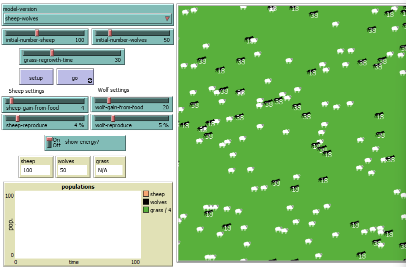
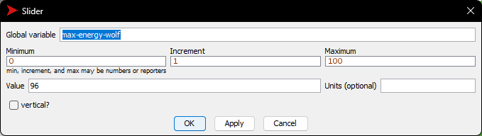
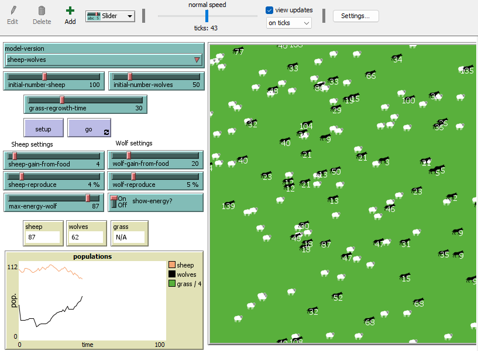
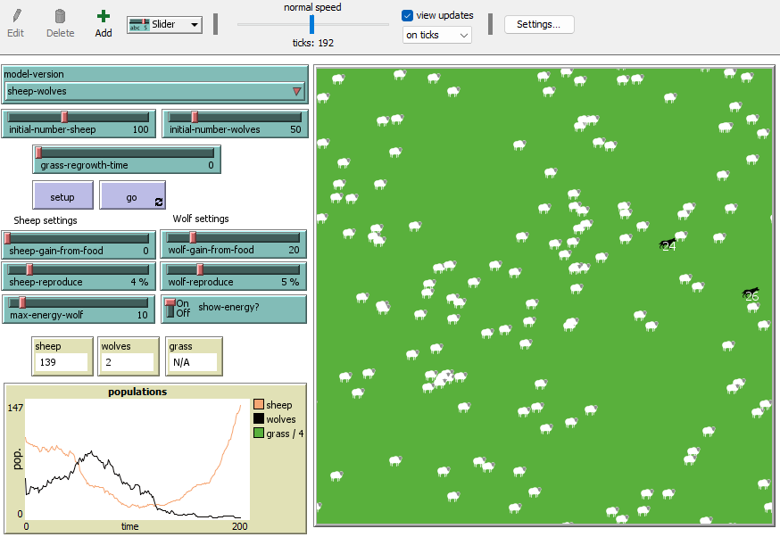
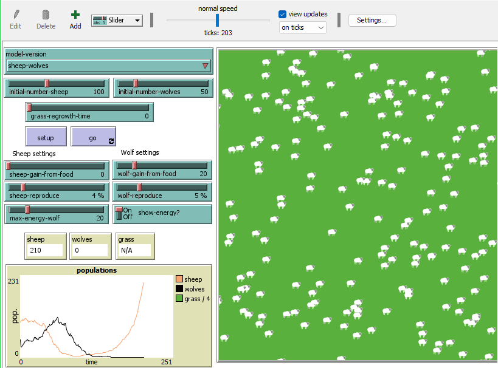
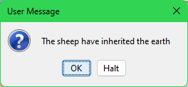
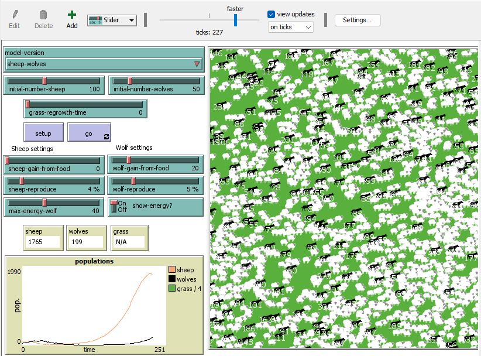
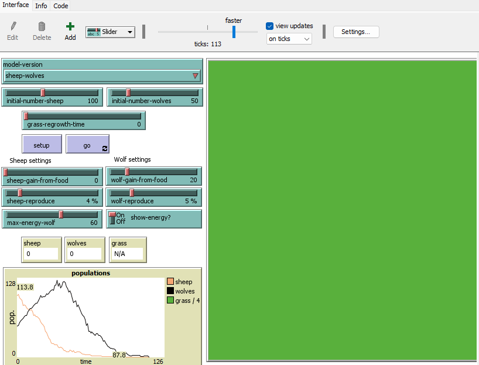
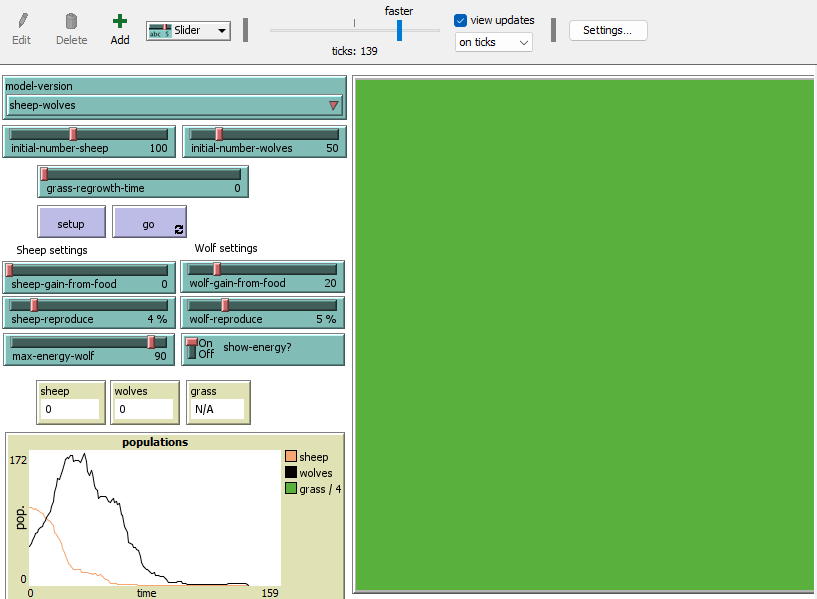

## Комп'ютерні системи імітаційного моделювання

## СПм-23-4, Дубихвіст Вадим Вячеславович

### Лабораторна робота №**2**. Редагування імітаційних моделей у середовищі NetLogo

 

### Варіант 7, Wolf Sheep Predation. Модель взаємоіснування хижаків та їх жертв. Модель у середовищі NetLogo:

[Wolf Sheep Predation](http://www.netlogoweb.org/launch#http://www.netlogoweb.org/assets/modelslib/Sample%20Models/Biology/Wolf%20Sheep%20Predation.nlogo)

### Оновлена логіка вовків

Вовки більше не діють зграйно. Перед кожним ходом вони тепер аналізують своє оточення, визначаючи, чи є поблизу вівці та чи відсутні інші вовки. На основі цього вони обирають напрямок руху. Якщо інших варіантів немає, вовк переміщається випадково. Якщо на одній клітині поля опиняються два вовки, залишається лише один.

Вівці, у свою чергу, рухаються випадковим чином. Якщо вони виявляють вовка на сусідній клітині, змінюють напрямок на протилежний.

---

### Логіка змін

Механіка була адаптована на основі моделей **"Rabbits Grass Weeds"** і **"Shepherds"**.

---

### Попередній код:

<pre>
  to move  ; стандартна процедура руху
    rt random 51
    lt random 51
    fd 1
  end
</pre>

Створив процедуру

<pre>
to wolf-move
  let nearby-sheep sheep in-radius 3  ; Finding surrounding sheep within a radius of 3 units
  let nearby-wolves other wolves in-radius 3  ; Finding surrounding wolves in a radius of 3 units
  ifelse any? nearby-sheep and not any? nearby-wolves  ; If there are sheep, but there are no wolves nearby
  [
    let target one-of nearby-sheep  ; Selecting one of the nearby sheep as a target
    face target  ; Rotation in the direction of the sheep
    fd 1
  ]
  [
    just-move  ; Move in a random direction if there are no sheep nearby
  ]
  if any? nearby-wolves  ; If there are wolves nearby
  [
    let target one-of nearby-wolves
    face target  ; Selecting one of the nearby wolves as a target to be avoided
    rt 180  ; Rotation in the opposite direction from the wolf
    fd 1
    let other-wolf one-of nearby-wolves
    let patch-of-other-wolf [patch-here] of other-wolf
    if patch-of-other-wolf = patch-here  ; Checking if another wolf is nearby in the same place
    [
      die  ; If another wolf is on the same patch, die
    ]
  ]
end
</pre>

, замінив назву **move** на **just-move** для більш зрозумілого синтаксису.
А також змінив частину процедури **to go** для того, щоб процедура **wolf-move**:

<pre>
...
ask wolves [
  wolf-move
...
</pre>

 

### Логіка овець

Вівці зазвичай переміщаються випадковим чином. Однак, якщо поруч із ними виявляється вовк, вони змінюють напрямок руху на протилежний, щоб уникнути небезпеки.

Після внесення змін у логіку переміщення вовків було реалізовано аналогічні зміни для поведінки овець.

<pre>
to sheep-move
  let nearby-wolves wolves in-radius 1  ; a variable containing a list of wolves within a radius of 1 unit from the sheep
  ifelse any? wolves in-radius 1  ; Check if there are wolves in radius 1
  [
    let target one-of nearby-wolves ; If there are wolves, choose one of them as a target
    face target
    rt 180  ; Turn the sheep so that it sees the chosen wolf
    fd 2  ; 
  ]
  [just-move]
end
</pre>

Та змінив частину процедури **to go** для того, щоб процедура **sheep-move**:

<pre>
...
ask sheep [
  sheep-move
...
</pre>

## Внесені зміни у вихідну логіку моделі, на власний розсуд:

### Додав вибір максимальної кількості енергії у вовків (аналог ситості у реальному житті)

Для більшої реалістичності моделі реалізовано механізм рандомізації початкового рівня енергії вовків. Тепер енергія кожного вовка визначається випадковим чином у діапазоні від 0 до максимально можливого значення, заданого користувачем. Це додає динамічності моделі, оскільки різні вовки матимуть різний стартовий рівень "ситості".

---

### Зміни в процедурі **setup**

Було модифіковано ту частину процедури **setup**, яка відповідає за створення вовків. Додано механізм визначення початкової енергії для кожного вовка.

---

<pre>
set energy max (list 0 (max-energy-wolf - random 2 * wolf-gain-from-food))
</pre>

### Спробував оптимізувати модель

Зробив це зменшив максимальну кількість овець у браузерному режимі та десктопному:
У процедурі **setup**:

<pre>
ifelse netlogo-web? [ set max-sheep 5000 ] [ set max-sheep 10000 ]
</pre>

## Обчислювальний експеримент

### Дослідження оптимального значення **max-wolf-energy**

Метою експерименту є дослідження впливу керуючого параметра **max-wolf-energy** на стабільність роботи моделі. Зокрема, визначається мінімальне значення цього параметра, за якого модель функціонує без критичних вимирань вовків або овець у перші цикли симуляції.

---

- **model-version** sheeps-wolves
- **initial-number-sheep** - 100
- **initial-number-wolves** - 50
- **grass-regrowth-time** - 0
- **sheep-gain-from-food** - 0
- **wolf-gain-from-food** - 20
- **sheep-reproduce** - 4
- **wolf-reproduce** - 5

Скріншоти та опис:

- **max-wolf-energy** 10

Як можна помітити - на 192 такті симуляції залишилося два вовки та 139 овець. Невдовзі вони померли тому що двом вовкам так і не вдалося наздогнати овець.

- **max-wolf-energy** 20

У цьому експерименті на 203 такті залишилося 0 вовків та 210 овець, що означає, що овці незабаром захоплять світ, про що нам повідомить відповідне вікно:

- **max-wolf-energy** 40

У цій симуляції овці та вовки розмножувалися майже рівномірно та коли овці захопили світ вовки досі існували, хоч і в меншій кількості.

- **max-wolf-energy** 60

Вовки були надто голодні та з'їли усіх овець, що призвело до голоду та смерті усіх агентів у симуляції.

- **max-wolf-energy** 90

Вовки знову надто швидко з'їли усіх овець та померли від голоду.

### Висновки

Результати експерименту показали, що керуючий параметр **max-wolf-energy** впливає переважно на початковий етап симуляції. Високе або низьке значення цього параметра визначає успішність старту моделі, тобто виживання вовків у перші цикли.

Однак, навіть за умов оновленої логіки поведінки вовків і овець, загальний результат моделі залишається рандомним. Це означає, що після початкового періоду подальший розвиток екосистеми залежить від випадкових подій у системі, а не від налаштувань параметра **max-wolf-energy**.

Таким чином, хоча оптимізація значення **max-wolf-energy** може зменшити ймовірність раннього вимирання вовків, вона не гарантує стабільності екосистеми в довгостроковій перспективі.
